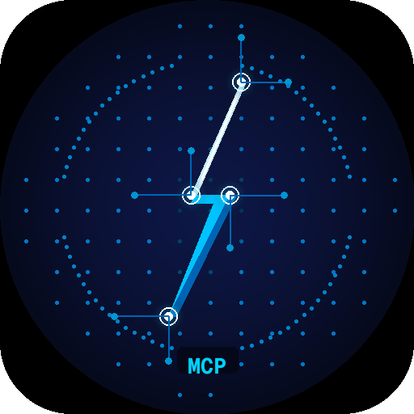

# thunderbird-mcp

A [Model Context Protocol](https://spec.modelcontextprotocol.io/) server that gives AI assistants (Claude, etc.) access to Thunderbird — email, contacts, calendar, and mail filters.

[](https://addons.thunderbird.net/en-US/thunderbird/addon/mcp-server/)

```
AI assistant ──stdio──▶ thunderbird-mcp (Rust) ──HTTP :45678──▶ Thunderbird extension (XPCOM)
```

## Features

| Category | Tools |
|----------|-------|
| **Mail** | `get_recent_messages`, `search_messages`, `get_message`, `update_message` |
| **Compose** | `send_email`, `reply_to_message`, `forward_message` |
| **Folders** | `list_accounts`, `list_folders`, `create_folder`, `delete_messages` |
| **Filters** | `list_filters`, `create_filter`, `update_filter`, `delete_filter`, `apply_filters` |
| **Contacts** | `search_contacts` |
| **Calendar** | `list_calendars`, `list_events`, `create_event` |

## Requirements

- **Thunderbird** 115 or later
- **Rust** stable (for building the binary)
- **Linux** (primary target; macOS/Windows untested)

## Installation

### 1. Download or build

**Pre-built (recommended):** grab `mcp-server.xpi` and `thunderbird-mcp-linux-x86_64` from the [latest release](https://github.com/mareurs/thunderbird-mcp/releases/latest).

Alternatively, install the extension directly from the [Thunderbird Add-ons gallery](https://addons.thunderbird.net/en-US/thunderbird/addon/mcp-server/) and download only the binary from the release.

**Build from source:**

```bash
git clone https://github.com/mareurs/thunderbird-mcp
cd thunderbird-mcp

cargo build --release          # builds ./target/release/thunderbird-mcp
./scripts/build.sh             # packages extension → ./dist/mcp-server.xpi
```

### 2. Install the extension

**From ATN (easiest):** open Thunderbird → **Add-ons and Themes** → search for "MCP Server" → Install.

**From file:** Open Thunderbird → **Add-ons and Themes** → gear icon → **Install Add-on From File** → select `dist/mcp-server.xpi` → restart Thunderbird.

The extension starts an HTTP server on `localhost:45678` and writes an auth token to `~/.thunderbird-mcp-auth`.

### 3. Configure your AI client

Create `.mcp.json` in your project (this file is gitignored — do not commit it):

```json
{
  "mcpServers": {
    "thunderbird": {
      "type": "stdio",
      "command": "/absolute/path/to/thunderbird-mcp/target/release/thunderbird-mcp",
      "args": []
    }
  }
}
```

For **Claude Code**, also add the `instructions` field — see [docs/system_instructions.md](docs/system_instructions.md) for the recommended content.

## How It Works

1. The Rust binary reads the auth token from `~/.thunderbird-mcp-auth` at startup.
2. It exposes an MCP server over stdio, registering all 20 tools.
3. Each tool call translates to a Bearer-authenticated HTTP POST to the extension.
4. The extension executes the operation using Thunderbird's XPCOM/WebExtension APIs and returns JSON.
5. The Rust binary sanitizes the response (strips control characters) and returns it to the MCP client.

## Known Limitations

- **IMAP staleness** — folder contents may lag behind the server until Thunderbird syncs. Retry if results look stale.
- **Spam folder** — can cause JSON parse errors due to control characters in message bodies. Avoid reading it directly.
- **`create_event`** — opens Thunderbird's event dialog instead of creating silently; requires user confirmation.
- **`apply_filters`** — async; the MCP response returns before messages are actually moved.
- **Gmail** — duplicates messages across labels. Always scope `get_recent_messages` / `search_messages` to a specific folder.

Known issues are tracked in [GitHub Issues](https://github.com/mareurs/thunderbird-mcp/issues).

## Development

See [CONTRIBUTING.md](CONTRIBUTING.md) for build setup, code structure, and contribution guidelines.

## Roadmap

See [ROADMAP.md](ROADMAP.md).

## License

MIT — see [LICENSE](LICENSE).
